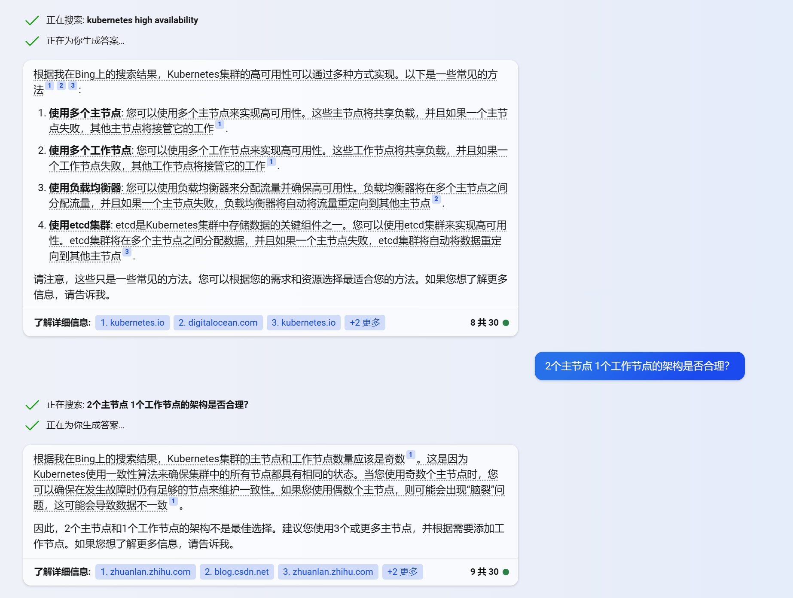

# requirement:
* [ ] 1.搭建k8s集群，版本大于1.27(选择1.28)
* [ ] 2.设置HPAScaleToZero=true,InPlacePodVerticalScaling=true
* [ ] 3.使用kata containerd作为runc

## 服务器选择
* 选择centos作为服务器系统
  * kata containerd有centos的[安装包](https://github.com/kata-containers/kata-containers/blob/main/docs/install/README.md#official-packages)
  * 集群[最小安装要求](https://github.com/kata-containers/kata-containers/blob/main/docs/install/README.md#official-packages)为**2c2G**内存，所以选择***4c8G***内存的服务器x1和***2c4G***内存的服务器x2
  * 主节点和工作节点的选择，根据从网上得到的信息，主节点一般为奇数，工作节点一般为偶数，所以选择x1为主节点，x2和x3为工作节点
  

## 安装k8s集群
### 可用的安装方式调研
* [sealos](https://docs.sealos.io/zh-Hans/docs/Intro)
  * 优点：安装简单，一键安装
  * 缺点：***sealos***可以看作为集群的***宝塔面板***，通过点击、账号等一键部署多种服务。我们的需求是安装最简单的k8s集群，使用kata containerd作为runc，所以***sealos***的功能过于臃肿，不适合我们的需求
* [kubeadm](https://kubernetes.io/zh-cn/docs/setup/production-environment/tools/kubeadm/install-kubeadm/)
  * ***kubeadm***是k8s官方推荐的安装方式，安装简单。但是kubeadm默认使用docker作为runc，所以需要修改配置文件，使用kata containerd作为runc。
  
### 高可用和测试环境推荐的架构

### GO!!!
* 服务器配置
  * x1: 4c8G
  * x2: 2c4G
  * x3: 2c4G
